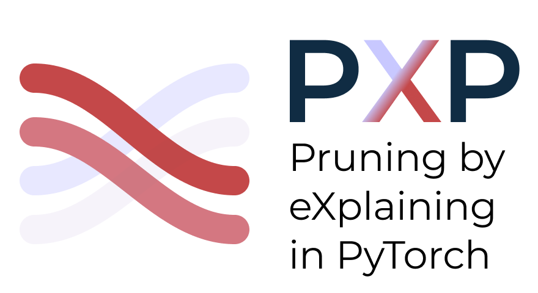

<div align="center">
  
</div>


# Pruning By Explaining Revisited: Optimizing Attribution Methods to Prune CNNs and Transformers

[](https://arxiv.org/abs/2408.12568)

Accepted at [eXCV Workshop](https://excv-workshop.github.io) of [ECCV 2024](https://eccv2024.ecva.net)

---

### Abstract

To solve ever more complex problems, Deep Neural Networks are scaled to billions of parameters, leading to huge computational costs. An effective approach to reduce computational requirements and increase efficiency is to prune unnecessary components of these often over-parameterized networks. Previous work has shown that attribution methods from the field of eXplainable AI serve as effective means to extract and prune the least relevant network components in a few-shot fashion. We extend the current state by proposing to explicitly optimize hyperparameters of attribution methods for the task of pruning, and further include transformer-based networks in our analysis. Our approach yields higher model compression rates of large transformer- and convolutional architectures (VGG, ResNet, ViT) compared to previous works, while still attaining high performance on ImageNet classification tasks. Here, our experiments indicate that transformers have a higher degree of over-parameterization compared to convolutional neural networks.

<div align="center">
  
  <p>Attribution-based pruning workflow</p>
</div>

---

Code is going to be published actively!

---

### Citation

Feel free to cite us, in case you have used our work:

```bibtex
@misc{hatefi2024pruningexplainingrevisitedoptimizing,
      title={Pruning By Explaining Revisited: Optimizing Attribution Methods to Prune CNNs and Transformers}, 
      author={Sayed Mohammad Vakilzadeh Hatefi and Maximilian Dreyer and Reduan Achtibat and Thomas Wiegand and Wojciech Samek and Sebastian Lapuschkin},
      year={2024},
      eprint={2408.12568},
      archivePrefix={arXiv},
      primaryClass={cs.AI},
      url={https://arxiv.org/abs/2408.12568}
}
```
